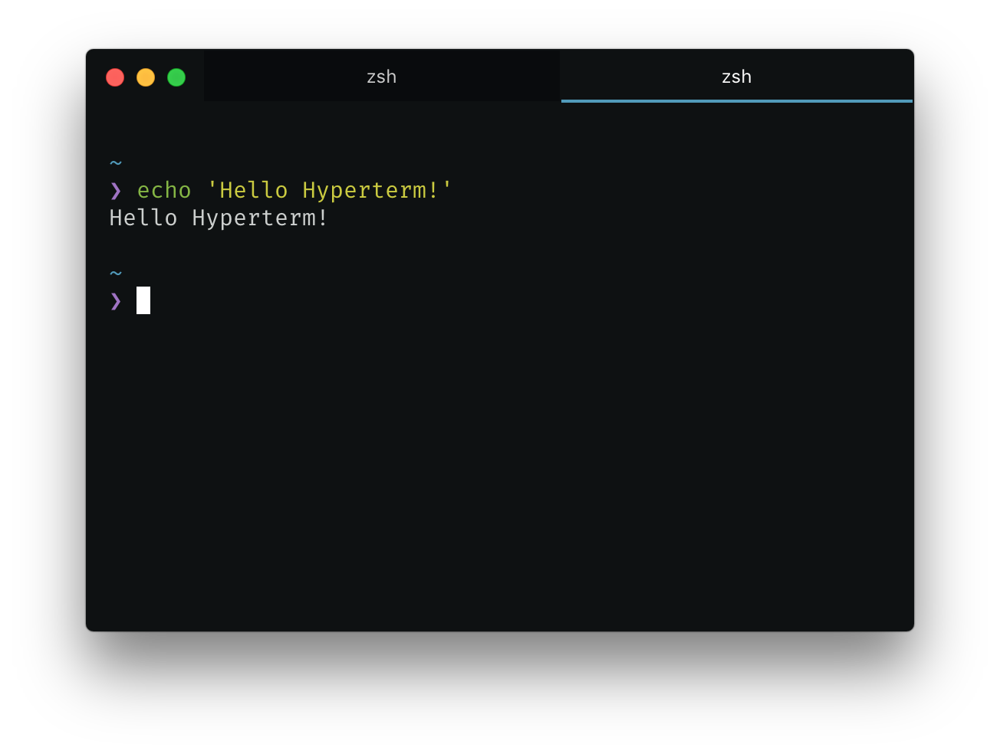

# hyper-seti

> Seti [Hyper](https://hyper.is) theme



[]()
[](https://travis-ci.org/stephensauceda/hyper-seti)
[](https://codecov.io/gh/stephensauceda/hyper-seti)
[]()
[](#contributors)

## Install

Add `hyper-seti` to the plugins list in your `~/.hyper.js` config file.

## Customization
If you'd like to customize the colors used in the theme, you can add a `themeOptions` object to `config` in your `.hyper.js` configuration. The available properties you can set within this object are mostly the same as the default Hyper options with a couple extra add. The properties you can set are:
 - foregroundColor
 - backgroundColor
 - borderColor
 - cursorColor
 - inactiveTabColor
 - activeTabColor
 - accentColor

**NOTE:** Due to the way Hyper themes currently work, user configuration is overwritten by the theme. So any colors you set outside of `themeOptions` will be ignored. If you want custom colors along with the theme, they **MUST** be set in `themeOptions`.

#### Example
```js
// ~/.hyper.js
module.exports = {
  config: {
    //default config stuff
    fontSize: 15,
    colors: [], // etc...

    // theme overrides
    themeOptions: {
      accentColor: 'orange'
    }
  },

  // add the theme
  plugins: [
    'hyper-seti'
  ]
}
```

## Contributors
Thanks goes to these wonderful people ([emoji key](https://github.com/kentcdodds/all-contributors#emoji-key)):

<!-- ALL-CONTRIBUTORS-LIST:START - Do not remove or modify this section -->
| [<br /><sub>Thomas Lindstrøm</sub>](http://t.hom.as)<br />[💻](https://github.com/stephensauceda/hyperterm-seti/commits?author=thomaslindstrom) |
| :---: |
<!-- ALL-CONTRIBUTORS-LIST:END -->

## License

MIT © [Stephen Sauceda](https://stephensauceda.com)
